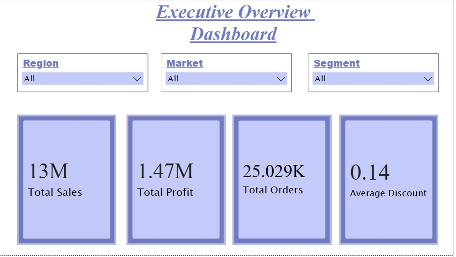

# 📊 Global Retail Sales Analytics Dashboard

An end-to-end data analytics project using Excel, SQL, and Power BI to analyze global retail sales, identify business trends, and build interactive dashboards.



## 📌 Project Overview

This project focuses on analyzing global retail sales data to uncover business insights, identify sales trends, evaluate regional performance, and understand customer purchasing behavior. The analysis was performed using Excel, SQL, and Power BI, resulting in an interactive dashboard that supports data-driven decision-making.

---

## 🎯 Objectives

- Analyze overall sales and profitability.
- Identify top-performing products and customers.
- Evaluate region-wise and market-wise sales performance.
- Track monthly sales trends.
- Understand customer segment contributions.
- Generate actionable business insights for stakeholders.

---

## 🛠️ Tools & Technologies

- **Microsoft Excel** – Data Cleaning & Preparation
- **SQL** – Data Analysis & Querying
- **Power BI** – Dashboard Development & Visualization
- **CSV Dataset** – Source Data

---

## 📂 Project Structure

```text
Global-Retail-Sales-Analytics
│
├── Dataset
│   └── Cleaned_dataset.csv
│
├── SQL
│   └── Task2_sqlqueries.sql
│
├── Excel
│   └── SQL_Analysis_File.xlsx
│
├── PowerBI
│   └── Sales_Performance_Dashboard.pbix
│
├── Report
│   └── Final_Business_Insights_Report.pdf
│
├── Screenshots
│   ├── 01_Executive_Overview.png
│   ├── 02_Sales_Analysis.png
│   └── 03_Product_Customer_Insights.png
│
└── README.md
```

---

## 📈 Dashboard Highlights

### Executive Overview
- Total Sales: **13M**
- Total Profit: **1.47M**
- Total Orders: **25K+**
- Average Discount Analysis

### Sales Analysis
- Region-wise Sales Performance
- Market-wise Sales Distribution
- Monthly Sales Trend Analysis
- Category-wise Sales Comparison

### Product & Customer Insights
- Top Performing Products
- Top Customers by Sales
- Profit by Sub-Category
- Customer Segment Analysis

---

## 📷 Dashboard Screenshots

### Executive Overview


### Sales Analysis


### Product & Customer Insights


---

## 🔍 Key Business Insights

- Technology products generated the highest sales revenue.
- Consumer segment contributed the largest share of total sales.
- Central region recorded the highest sales performance.
- Certain sub-categories produced significantly higher profits than others.
- Sales demonstrated an overall upward trend over time.
- A small group of customers contributed a substantial portion of revenue.

---

## 📊 Skills Demonstrated

- Data Cleaning
- Data Analysis
- SQL Query Writing
- KPI Development
- Data Visualization
- Dashboard Design
- Business Intelligence
- Reporting & Insights Generation

---

## 🚀 Future Enhancements

- Add forecasting models for future sales prediction.
- Create advanced customer segmentation.
- Integrate real-time data sources.
- Include interactive drill-through reports.

---

## 👩‍💻 Author

**Pari Gupta**

Aspiring Data Analyst | SQL | Excel | Power BI | Python

GitHub: https://github.com/parishree-gupta

---

⭐ If you found this project useful, feel free to star the repository.
